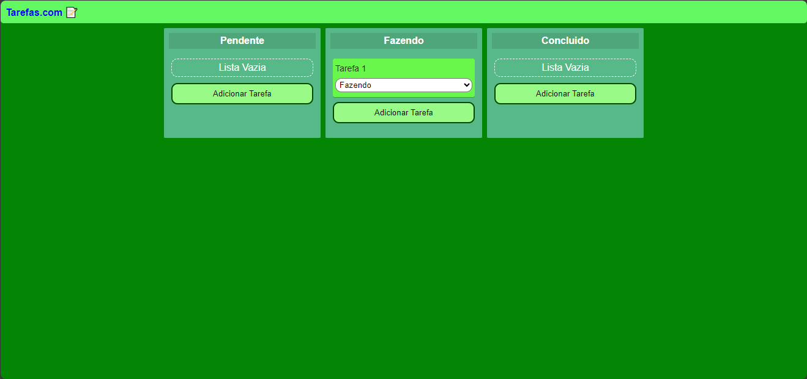

# Tarefas.com 📝

Projeto feito com o objetivo de criar uma lista de tarefas. Contém os campos: Pendende, Fazendo e Feito. O site permite editar, apagar e mudar de status cada tarefa. Feito durante o Curso [React Para Iniciantes](https://www.udemy.com/course/react-para-iniciantes-free/) feito na [Udemy](www.udemy.com).

  <a href="#-tecnologias">Tecnologias</a>&nbsp;&nbsp;&nbsp;|&nbsp;&nbsp;&nbsp;
  <a href="#-projeto">Projeto</a>&nbsp;&nbsp;&nbsp;|&nbsp;&nbsp;&nbsp;
  <a href="#-contato">Contato</a>&nbsp;&nbsp;&nbsp;

  

 

## 🚀 Tecnologias

Esse projeto foi desenvolvido com as seguintes tecnologias:

- 

- 

- 

- 

- 

- 

## 💻 Projeto

Site para ver o projeto completo:

[🔗 Clique aqui para acessar]()

# 📱 Contato
rafaeluzan@live.com